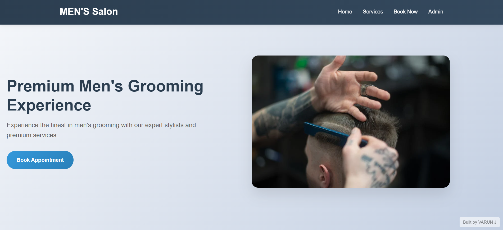
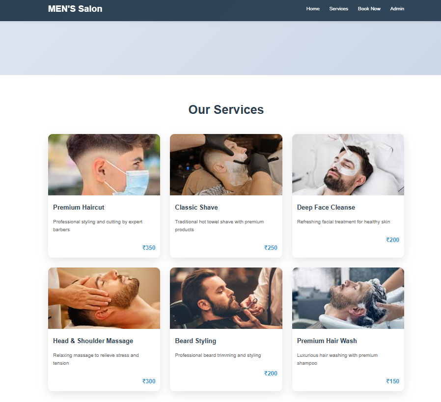
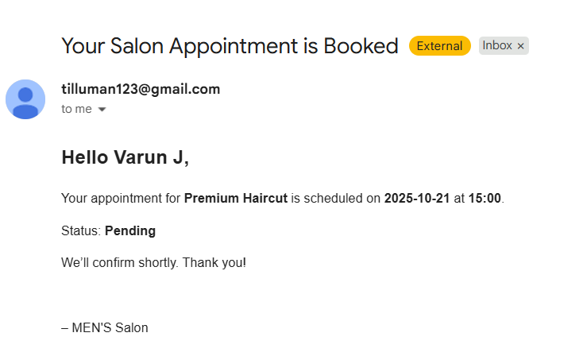
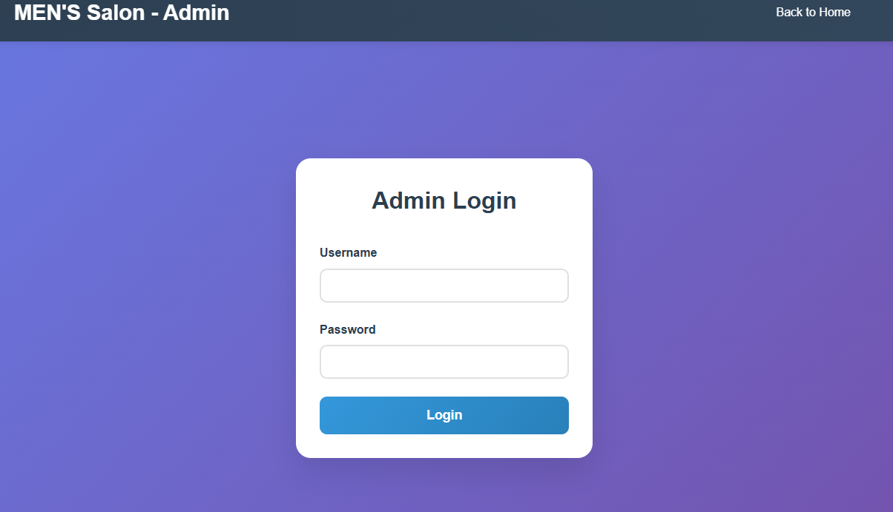
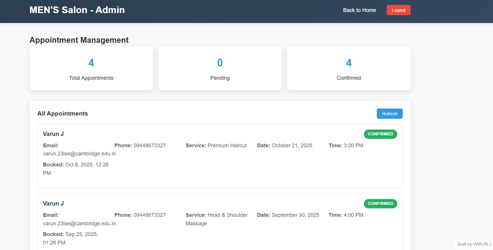
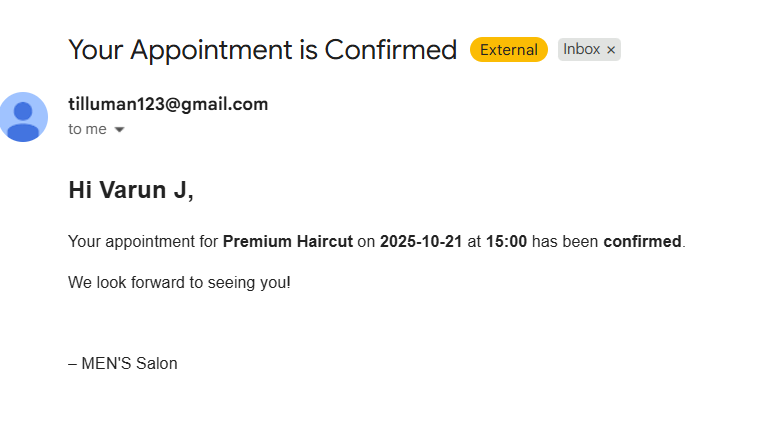

# 💇‍♂️ Salon Appointment Management System

A full-stack web application for booking, managing, and tracking salon appointments.

---

## 🌟 Features

### 👥 User Side
- 📅 Book appointments with name, email, phone, date, time, and service
- 📧 Receive confirmation or rejection emails

### 🧑‍💼 Admin Side
- 🔐 Secure admin login (credentials stored via environment variables)
- 📊 View dashboard with all appointments: pending, confirmed, rejected
- ✅ One-click approval/rejection
- 📈 Statistics panel showing totals

---

## 🧰 Tech Stack

| Layer     | Technology             |
|-----------|------------------------|
| Backend   | Node.js, Express       |
| Database  | SQLite                 |
| Frontend  | HTML, CSS, JavaScript  |
| Email     | Nodemailer + Gmail App Password |

---

## 📸 Screenshots

> 📌 All screenshots are stored in the `assets/images/` folder.

### 🏠 Home Page  


### 💈 Services Section  


### 📅 Booking Form  


### 🔐 Admin Login  


### 📊 Admin Dashboard  


### 📧 Email - Booking Message  


### ✅ Email - Confirmation Message  


---

## 🛠️ Getting Started

### 🔧 Prerequisites
- Node.js (v18+)
- Gmail account with App Password enabled

### 📦 Installation


### 🔐 Environment Setup

Create a `.env` file in the root directory:

```env
EMAIL_USER=yourgmail@gmail.com
EMAIL_PASS=yourapppassword
ADMIN_USER=youradminusername
ADMIN_PASS=youradminpassword
```

> ⚠️ Don’t commit your `.env` file. It should be listed in `.gitignore`.

---

### ▶️ Run the Application

```bash
node server.js
```

Then open: [http://localhost:8000](http://localhost:8000)

---

## 📂 Folder Structure

```
salon-appointment-system/
├── client/
│   ├── index.html
│   ├── styles.css
│   └── script.js
├── admin.html
├── admin.js
├── server.js
├── salon.db
├── .env
├── .gitignore
├── README.md


---

## ✉️ Email Configuration Notes

- Gmail must have **2-Factor Authentication** enabled
- Generate a Gmail **App Password**:  
  👉 [https://myaccount.google.com/apppasswords](https://myaccount.google.com/apppasswords)

---

## 💡 Future Enhancements

- 🔐 JWT-based authentication
- 📱 SMS notifications via Twilio
- 🧾 Appointment summary emails
- 🎨 UI enhancement using TailwindCSS or Bootstrap
- 🌐 Cloud database (e.g., MongoDB, PostgreSQL)

---

## 🤝 Contributing

 
Feel free to submit issues or pull requests for improvements !

---


